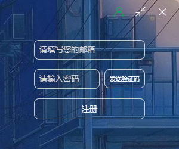
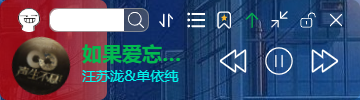
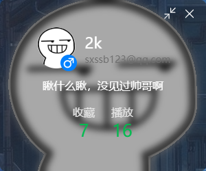

<div align=center>
 <div align=center margin="10em" style="margin:4em 0 0 0;font-size: 30px;letter-spacing:0.3em;">

 </div>
 <h2 align=center style="margin: 1em 0; padding-bottom:1em;">音乐条 | Music-Bar</h2>
<div>
      <a href="https://github.com/2kailsy/musicBar" target="_blank">
        
      </a>
      <a href="https://github.com/2kailsy/musicBar/stargazers" target="_blank">
        
      </a>
    </div>
    <div>
      <a href="https://github.com/2kailsy/musicBar/commits" target="_blank">
        
      </a>
      <a href="https://github.com/2kailsy/musicBar/issues" target="_blank">
        
      </a>
      <a href="https://github.com/2kailsy/musicBar/blob/master/LICENSE" target="_blank">
        
      </a>
    </div> 

Language : [简体中文](./README.md) | English
</div>

## 🌐Introduction

### Summarize

Welcome🎉 ：A desktop application for listening to music! Based on vue, node and electron technology stack

Note: This project has limited functions and is for learning only.
## 📷screenshot
- Login page(login.vue)

- Registration page(login.vue)

- Homepage(music.vue)

- Lyric page(music.vue)

- Search page(userCenter.vue)

- Collect page

- UserCenter page(userCenter.vue)


## ⏳ Start
Seeing similar works on Bilibili,try to develop by myself
## ✨ Development
#### 🎨 Frontend

1.Prerequisites
- Node.js 20.0.0+
- npm 8.0.0+

2.Install Dependencies and Start
```sh
cd musicPlayer;
npm install OR npm i
```
3. 启动项目
```sh
npm run dev
```
#### 🖥 Backend

1.Prerequisites
- Node.js 20.0.0+
- npm 8.0.0+
- MySQL 8.0+

2.Configuration
- Clone the project to your local machine
- Create a database and import the SQL script
- Go to the `Musicapi` folder and find the` config.js` configuration `jwt key`, `` mailbox SMTP` and `database account passwords`
- Start the project

3.Start the Project
  ```sh
    node app.js;
  ```
#### 🎊 Desktop
  ```sh
    npm i electron -g;
    cd electron;
    electron main.js;
  ```

## 🔧Frontend - Tech Stack

<details>
<summary>Expand</summary>

| Category         | Technology/Component          | Version       |
| ------------ | ----------------- | ------------ |
| Package Manager | npm             | 10.8.2       |
| Framework | Vue | ^3.2.45      |
|              | electron        | ^24.1.2      |
| Build Tool | Vite | ^4.1.0      |
| Internationalization |-|-|

</details>

## 🖥Backend - Tech Stack

<details>
<summary>Expand</summary>

| Type| Library| Version| Description|
|-------------|----------------------------------------------|-------------|-----------------------------------|
|  **Main Framework**  | **express**| **^4.18.2** | **Back end (provided interface)**|
|             | express-jwt | ^5.3.3     | Provides JWT authentication support |
|             | joi         | ^17.9.1    | Provide data verification ability    |
| **Database ** |**MySQL**        | ^2.18.1 | **MySQL Database Driver** |
</details>

## 📦License

This project is licensed under the . For details, please refer to the LICENSE file.`GNU Affero General Public License v3.0`

We hope you enjoy using this project! If you have any questions, please feel free to contact us.
