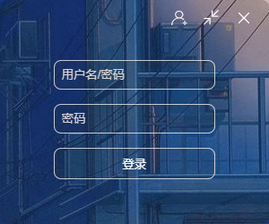
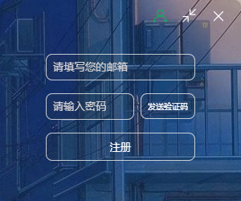
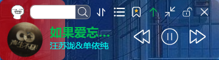
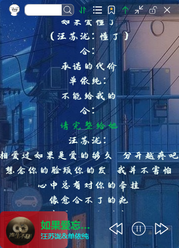
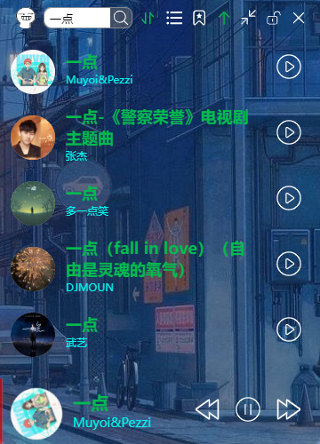
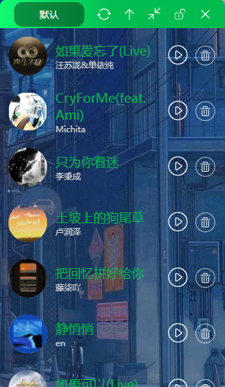
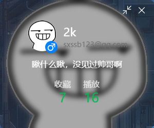

<div align=center>
 <div align=center margin="10em" style="margin:4em 0 0 0;font-size: 30px;letter-spacing:0.3em;">

 </div>
 <h2 align=center style="margin: 1em 0; padding-bottom:1em;">音乐条 | Music-Bar</h2>
<div>
      <a href="https://github.com/2kailsy/musicBar" target="_blank">
        
      </a>
      <a href="https://github.com/2kailsy/musicBar/stargazers" target="_blank">
        
      </a>
    </div>
    <div>
      <a href="https://github.com/2kailsy/musicBar/commits" target="_blank">
        
      </a>
      <a href="https://github.com/2kailsy/musicBar/issues" target="_blank">
        
      </a>
      <a href="https://github.com/2kailsy/musicBar/blob/master/LICENSE" target="_blank">
        
      </a>
    </div>

语言 : 简体中文 | [English](./README.en.md)
</div>

## 项目介绍

### 概述

欢迎🎉 ：一个用来听歌的桌面应用！基于vue、node及electron技术栈

注：本项目功能有限，仅供学习。
## ✨项目截图
- 登录页(login.vue)

- 注册页(login.vue)

- 主页(music.vue)

- 歌词页(music.vue)

- 用户中心(userCenter.vue)

- 收藏页

- 用户中心(userCenter.vue)


## ⏳ 起步
在B站上看到类似作品尝试自己开发

#### 🎨 前端

1. 前置环境
- Node.js 20.0.0+
- npm 8.0.0+

2. 安装依赖和启动
```sh
cd musicPlayer;
npm install 或 npm i
```
3. 启动项目
```sh
  npm run dev;
```
#### 🖥 后端

1. 前置环境
- Node.js 20.0.0+
- npm 8.0.0+
- MySQL 8.0+

2. 配置
- 克隆项目到本地
- 创建数据库，导入SQL脚本
- 去到`musicApi`文件夹下找到`config.js`配置`jwt密钥`、`邮箱smtp`与`数据库账户密码`
- 启动项目

3. 启动项目
  ```sh
    node app.js;
  ```
#### 🎊 桌面端
  ```sh
    npm i electron -g;
    cd electron;
    electron main.js;
  ```

## 🔧 前端 - 涉及技术栈 | Tech Stack

<details>
<summary>展开</summary>

| 类别         | 技术/组件          | 版本号       |
| ------------ | ----------------- | ------------ |
| 包管理器     | npm             | 10.8.2       |
| 框架         | Vue             | ^3.2.45      |
|              | electron        | ^24.1.2      |
| 构建工具      | Vite            | ^4.1.0      |
| 国际化       | -                | -            |

</details>

## 🖥 后端 - 涉及技术栈 | Tech Stack

<details>
<summary>展开</summary>

| 类型          | 库                                            | 版本号         | 功能描述                              |
|-------------|----------------------------------------------|-------------|-----------------------------------|
|  **主框架**  | **express**| **^4.18.2** | **后端(提供接口)**|
|             | express-jwt | ^5.3.3     | 提供JWT身份验证支持 |
|             | joi         | ^17.9.1    | 提供数据校验能力    |
| **数据库** |**MySQL**        | ^2.18.1 | **MySQL数据库驱动** |
</details>

## 📦License

此项目遵循 ``GNU Affero General Public License v3.0`` 许可证，具体内容请查看 LICENSE 文件。

希望您在使用此项目时感到愉快！如有任何问题，请随时联系。
